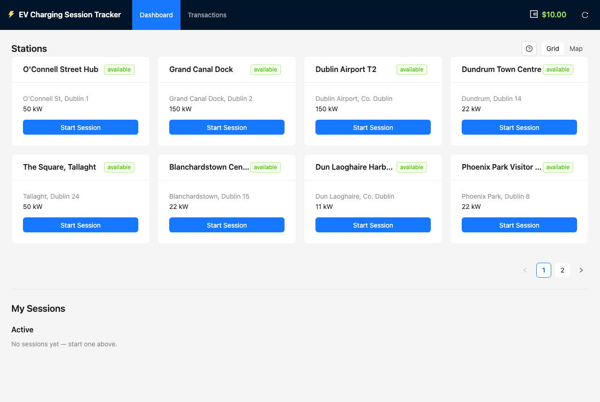
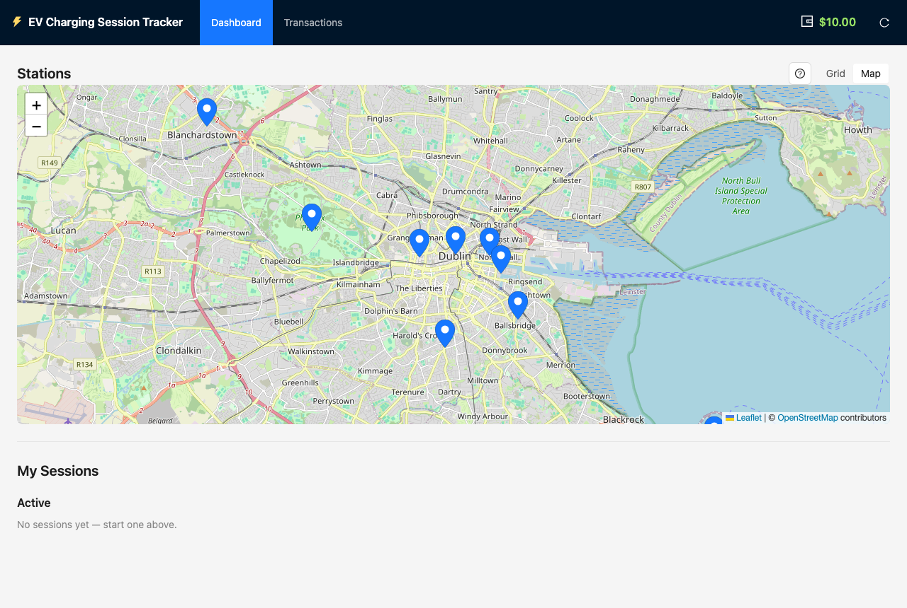
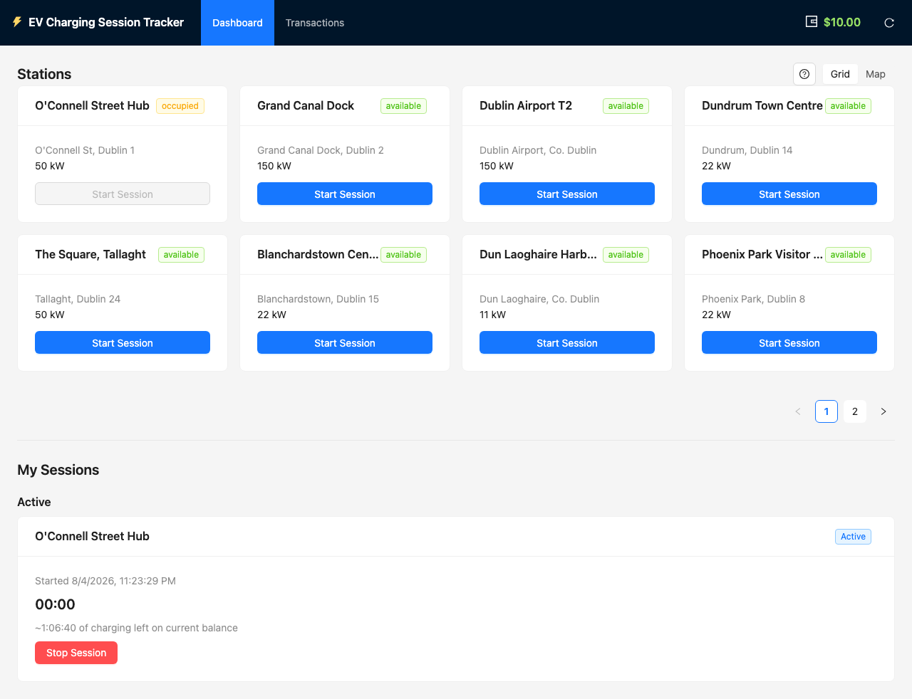
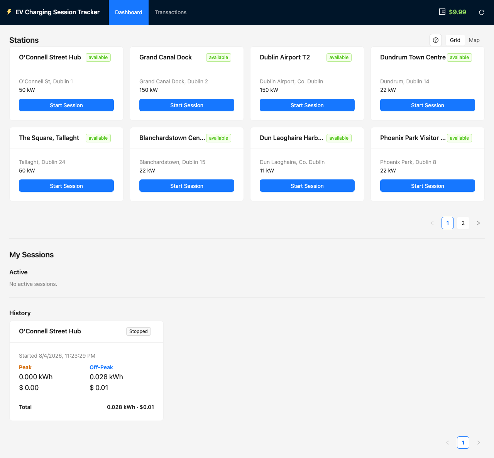
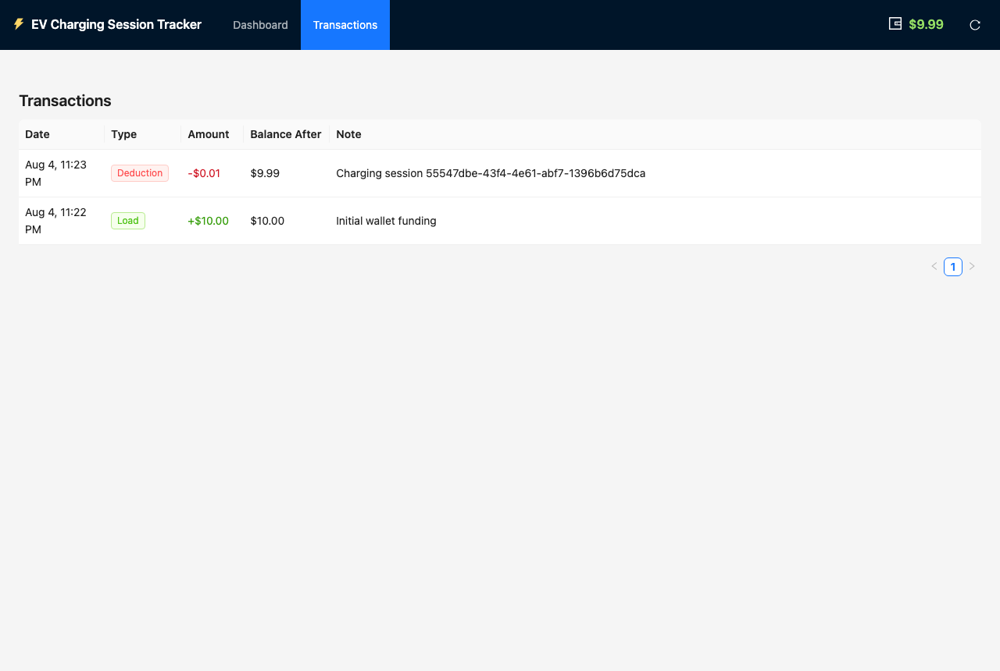
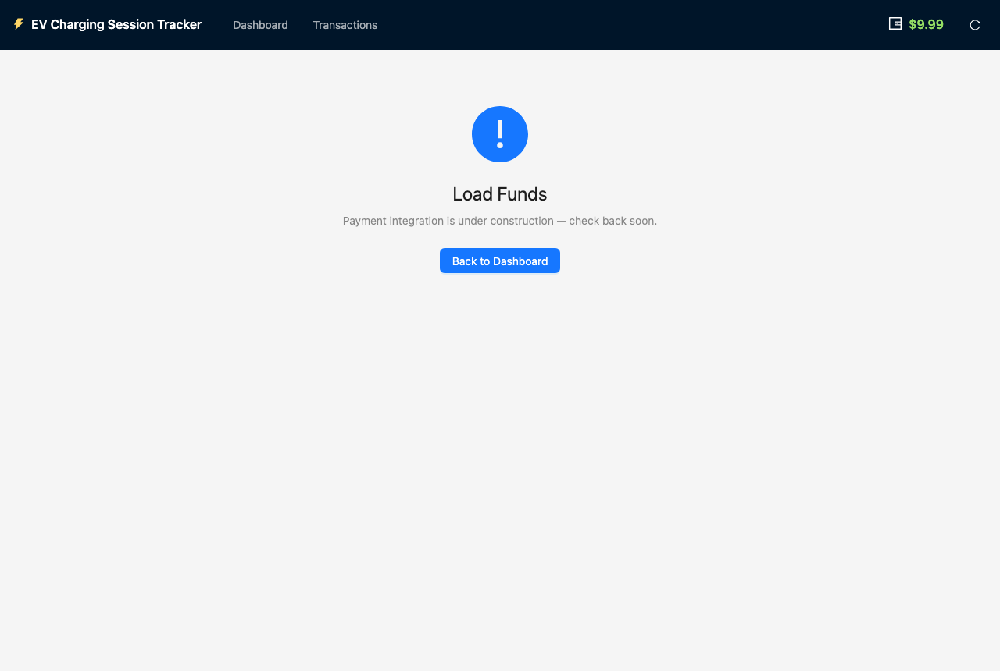
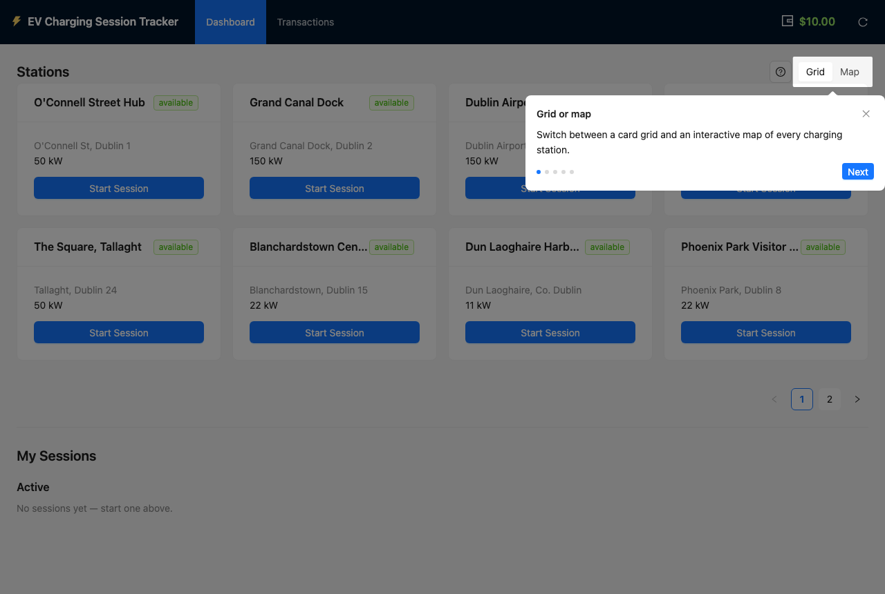

# EV Charging Session Tracker

A full-stack demo: browse charging stations, start a session, stop it, and
see a cost breakdown that splits peak vs. off-peak energy and cost —
because a session that spans both bands should be billed for time actually
spent in each, not a flat rate for the whole thing.

**Live demo**: https://ev-design-station-server-oir2.vercel.app/
(backend: https://ev-charging-server-u19y.onrender.com — free-tier, see
cold-start note under Deploying). There's a reset button in the header
(top-right, next to the wallet balance) if you want a clean slate after
poking around — see "Reset demo data" further down.

## Screenshots

| | |
|---|---|
| **Stations — grid view**<br> | **Stations — map view**<br> |
| **Active session**, live cost-so-far and time-left estimate<br> | **Stopped session**, peak/off-peak cost split<br> |
| **Transactions** — full wallet audit log<br> | **Load Funds** — intentional stub<br> |
| **First-visit walkthrough tour**<br> | |

## Tech stack

- **Frontend**: React + Vite + TypeScript, Ant Design (antd), React Router,
  React Leaflet + OpenStreetMap tiles (map view — free, no API key)
- **Backend**: Express + TypeScript
- **Data**: in-memory repositories behind interfaces (`StationRepository`,
  `SessionRepository`, `WalletRepository`) — swappable for a real DB later
  with no controller/service changes
- **Testing**: Vitest + Supertest
- **Repo layout**: npm workspaces monorepo — `/client`, `/server`, `/shared`

## Setup & run

Requires Node 20+ (built and tested on Node 24) and npm 10+.

```bash
npm install   # installs client, server, and shared together (npm workspaces)
```

Local dev works with **zero `.env` files** — both packages fall back to
sensible localhost defaults. Copy the `.env.example`s only if you want to
override something (a different port, a deployed API URL, etc.):

```bash
cp server/.env.example server/.env
cp client/.env.example client/.env
```

Run both dev servers (two terminals, from the repo root):

```bash
npm run dev:server   # Express on http://localhost:4000
npm run dev:client   # Vite on http://localhost:5173
```

Open http://localhost:5173.

Other useful scripts, all runnable from the repo root:

```bash
npm run test:server    # 82 tests: pricing edge cases, repositories, API integration, auto-stop monitor
npm run build:server
npm run build:client
```

## Architecture, and why

```
server/src/
  routes/        HTTP layer only — no business logic
  controllers/   parse the request, call a service, shape the response
  services/      business logic (pricing calculation, session rules)
  repositories/  data access behind an interface
  models/        shared domain types (re-exported from /shared) + zod schemas
  middleware/    validation, error handling, rate limiting
```

**Dependency inversion.** `sessionService` and `stationService` are built
via factory functions that take a `StationRepository`/`SessionRepository`
*interface* as a dependency, never the concrete `InMemory...` class. Swapping
in a SQLite-backed implementation later means writing a class that satisfies
the same interface and changing one line in `app.ts` — no controller or
service code moves.

**Pricing logic is one pure function.** `calculateCost` in
`services/pricingService.ts` takes `(startTime, endTime, chargingSpeedKw,
rateSchedule)` and returns a `CostBreakdown`. No Express, no repository, no
I/O — it walks the interval boundary-by-boundary (each day's 08:00/20:00
crossing), prices each sub-interval by duration × kW × the applicable rate,
and sums. It's tested in complete isolation, covering every edge case in the
spec (entirely peak, entirely off-peak, one boundary crossing in each
direction, a multi-day session crossing several boundaries, start/end
landing exactly on a boundary, zero-duration, and rounding behavior).

**Fail-safe defaults, applied at every layer:**
- `zod` validates every request body/params shape before it reaches a
  service (`models/schemas.ts` + `middleware/validate.ts`) — a malformed
  request never gets as far as business logic.
- A centralized error handler maps typed errors (`NotFoundError`,
  `ConflictError`, `ValidationError`) to the right status code and never
  leaks a stack trace; anything unexpected becomes a generic 500.
- `config.ts` fails **at startup** if `CORS_ORIGIN` is missing while
  `NODE_ENV=production`, rather than silently falling back to `localhost`
  and quietly breaking for every real user.

**Concurrency safety on station status.** `StationRepository.tryOccupy` is a
single atomic check-and-set: it reads the station's status and flips it to
`occupied` in the same synchronous step, so two racing `POST /sessions` for
the same station can't both pass the "is it available" check before either
writes. This is verified two ways: a repository-level test that fires 20
concurrent `tryOccupy` calls at one station and asserts exactly one
succeeds, and an integration test that does the same thing through the full
HTTP stack (10 concurrent `POST /sessions`, exactly one 201).

**Security, done rather than listed:** `helmet` (with
`crossOriginResourcePolicy: cross-origin`, since the default `same-origin`
would otherwise block the deployed frontend's fetch calls to this API even
with valid CORS headers present — a real bug I hit and fixed while testing
this in an actual browser, since `curl` can't reveal a browser-enforced
header like CORP); CORS restricted to an explicit origin allowlist;
`express-rate-limit` on the two mutating endpoints (session start/stop —
the `GET` routes are unlimited); `trust proxy` enabled in production only,
since Render/Railway sit behind a reverse proxy and rate limiting would
otherwise key off the proxy's IP for every client.

(One dependency-level judgment call: `react-router-dom` is pinned to
`^7.18.2` despite `npm audit` still flagging one high-severity advisory
against it — an RSC-mode CSRF bypass. This app only uses client-side
`BrowserRouter`/`Routes`, never React Server Components or server actions,
so that code path is unreachable here; every *other* currently-known
react-router advisory, covering a much wider version range, is already
fixed at 7.18.2. Downgrading to silence this one flag would reintroduce
several real, applicable ones.)

**Frontend state is plain React hooks**, not a state-management library —
`useStations` polls `GET /stations` every 5s (plus an immediate refresh
after any start/stop) and `useMySessions` tracks the sessions this browser
started. The app's actual state surface is small enough that reaching for
Redux/Zustand/React Query would be adding a dependency to solve a problem
that doesn't exist yet.

**Wallet (added beyond the original spec).** A single demo wallet — no
per-user accounts — backed by the same repository-interface pattern as
stations and sessions (`WalletRepository`, `GET /wallet`). Two rules,
each living where it belongs:
- *Starting* a session checks `wallet.balance > 0` before touching station
  state, in `sessionService.startSession`. It's a coarse gate ("can they
  charge at all"), not a hold on the eventual cost — that cost isn't known
  until the session stops. Insufficient balance returns `402 Payment
  Required`, which the frontend maps to a redirect to `/load-funds` instead
  of a generic error banner.
- *Stopping* a session always deducts the computed cost via
  `WalletRepository.deduct`, unconditionally — energy already got
  delivered, so this can't be refused the way starting can, even if it
  pushes the balance negative. Every load and deduction is recorded as a
  `WalletTransaction` (visible on the **Transactions** tab), so the balance
  is always reconstructable from its history, not just a mutable number.

**Low-balance warning & auto-stop (added beyond the original spec).** The
wallet is a single balance shared by every active session, not a per-session
hold — so "how long can I keep charging" and "should this stop now" are both
questions about the *combined* draw of everyone currently plugged in, not
any one session in isolation.

- `sessionService.attachChargeEstimate` (in `services/sessionService.ts`)
  computes a live `chargeEstimate` on every session response
  (`{ costSoFar, ratePerHour, secondsRemaining }`, `null` once stopped).
  `costSoFar`/`ratePerHour` are that session's own numbers, but
  `secondsRemaining` is a shared countdown: `(wallet.balance − combined cost
  so far of every active session) / combined rate of every active session`.
  Starting a second session immediately shortens the first one's projected
  time left, even though nothing about the first session changed — covered
  by an integration test in `app.integration.test.ts`. The projection holds
  the current peak/off-peak rate constant (it doesn't try to predict a rate
  change before the balance runs out) — a deliberate approximation for a
  live warning, not meant to be as exact as the final `calculateCost`
  billing.
- `services/sessionMonitor.ts` is the app's first timer: a 5-second
  `setInterval` (started only from `index.ts`, never from `createApp`
  itself, so the test suite's many direct `createApp()` calls never leak a
  live interval) that re-checks every active session and auto-stops it via
  the same `sessionService.stopSession` the manual endpoint uses. Two
  triggers, each stamping a `stopReason` on the session:
  - `insufficient_funds` — once the **combined** cost-so-far of every active
    session reaches the wallet balance, *every* active session is stopped,
    not just whichever one happened to tip it over. There's no per-session
    allocation to point to, so once the pooled balance is gone, none of them
    can legitimately keep drawing on it.
  - `duration_elapsed` — a session can optionally be started with
    `autoStopAfterMinutes`; `startSession` stamps a fixed `autoStopAt`
    timestamp at start time, and the monitor stops the session once
    `now >= autoStopAt`.
- The duration is chosen per session, not as a standing setting: clicking
  "Start Session" (grid card or map popup) opens `StartSessionModal`
  first, which asks how long to charge for and shows what that's
  estimated to cost at the current rate (`GET /rate-schedule` exposes the
  static config so the client can mirror `pricingService.isPeak`'s exact
  UTC-hour rule) before confirming. If the estimate exceeds the wallet
  balance, a warning explains that upfront — the Start Session button
  stays enabled regardless, since an underfunded session is exactly what
  the `insufficient_funds` auto-stop above already handles gracefully.
- On the frontend, `SessionCard` shows "~X of charging left on current
  balance" for an active session, escalating to a warning/error `Alert`
  once projected time left drops under 10 minutes or hits zero; a stopped
  card tags *why* it stopped when that wasn't a manual click. `useMySessions`
  polls every 5s so a session this monitor auto-stops server-side is picked
  up without the user touching anything.

**Map view (added beyond the original spec).** The Stations section has a
Grid/Map toggle (`antd Segmented`); both read the exact same `GET
/stations` data, just displayed differently. The map (`StationMap.tsx`,
React Leaflet + OpenStreetMap tiles) plots every station at its seeded
lat/lng, all within Dublin, Ireland; clicking a pin opens a popup with the
same info and Start Session action as a grid card. Occupied stations render
with a grey pin instead of blue — both icons are inline SVG via
`L.divIcon`, not Leaflet's default marker images, which need bundler-
specific path patching to load correctly under Vite (a well-known Leaflet+
bundler gotcha, sidestepped entirely by not depending on those default
image assets).

**Reset demo data (added beyond the original spec).** `POST /reset` wipes
every piece of mutable state back to its seeded starting point in one call
— all stations back to available, every session cleared, and the wallet
reset to its $10 starting balance (recorded as a fresh "Initial wallet
funding" transaction, same as the first boot). Each repository owns its
own `reset()` (`StationRepository`, `SessionRepository`,
`WalletRepository`), and `resetService` just calls all three — matching
the interface-per-repository pattern used everywhere else, rather than
reaching into their internals from one place. The frontend's reset button
(top-right, next to the wallet balance) confirms via a `Popconfirm`
warning before calling it, then clears the browser's own
`localStorage`-tracked session ids and reloads the page — simplest way to
guarantee every hook picks up the reset state instead of threading a
"refresh everything" callback through each one. This exists purely so
anyone testing the app (including the deployed demo, after other people
have poked at it) can get back to a clean slate without restarting the
server — it's a testing convenience, not a feature a real product would
expose to end users.

**First-visit walkthrough tour (added beyond the original spec).**
`antd`'s `Tour` component (already a dependency — no new package) spotlights
five things in order, first time the app loads in a given browser: the
Grid/Map toggle, Active sessions, History, Transactions, and the reset
button. A "?" icon next to the Stations heading re-opens it anytime after
that.

- Targets DOM elements by `id` rather than refs, so `Dashboard.tsx` can
  point the tour at elements owned by `App.tsx`'s header (nav, reset
  button) without threading refs down through the component tree.
- History gracefully degrades to a centered, non-spotlit step when it
  doesn't exist yet in the DOM — true for every first-time visitor, since
  a session has to be stopped once before History renders at all.
- The "seen" flag uses a lazy `useState` initializer
  (`useState(() => !localStorage.getItem(...))`), not an effect +
  `setTimeout`. An effect-based version raced React 18 StrictMode's
  double-invoked effects in dev: the first mount's cleanup canceled the
  timer before it fired, and the second mount saw the flag the first one
  had already written and skipped rescheduling, so the tour silently never
  opened. Caught by actually running it in a browser, not by reasoning
  about the code.

## Assumptions

- **Peak/off-peak boundaries are evaluated in UTC**, not server-local or
  station-local time. There's no station-location or user-locale concept in
  this project, so one fixed reference frame is used everywhere rather than
  letting results depend on whatever timezone the host machine happens to
  be in (which would differ between a laptop and a Render container). A
  real product would tie this to the station's actual timezone.
- **Multiple concurrent sessions are allowed, one per station.** There's no
  login, so "one active session" is scoped per station rather than
  globally per user — this is also what the API surface implies (`POST
  /sessions` only rejects if *that station* is occupied).
- **"My Sessions" on the frontend is a browser-local list**, not a real
  account. There's no login in scope, so the client just remembers the ids
  of sessions it started (in `localStorage`) and treats the server as the
  source of truth for their actual state — the closest approximation of
  "your sessions" without inventing a fake auth system.
- **Session-stop has a known, narrower concurrency guarantee than
  session-start.** Starting a session is protected by an atomic
  compare-and-set (`tryOccupy`). Stopping one is a plain check-then-write —
  the spec scoped the concurrency requirement to station status
  specifically, so two simultaneous stop requests for the exact same
  session id aren't guarded against. A DB-backed implementation would
  close this with a conditional `UPDATE ... WHERE end_time IS NULL`.
- **Cost is computed once, at stop time, and stored** on the session
  record — not recomputed on every `GET`. This matches how real billing
  works: if rates changed later, what you were already charged shouldn't.
- **Rates and station data are hardcoded seed data**, per spec, held only
  in process memory — restarting the server resets everything to the
  seeded state. The wallet's seeded starting balance ($10) works the same
  way.
- **All 12 seeded stations are in Dublin, Ireland**, with real lat/lng for
  recognizable landmarks (O'Connell Street, Dublin Airport, Grand Canal
  Dock, etc.) — chosen so the map view has one coherent, real city to
  center and bound itself on rather than scattered placeholder pins with
  no relationship to each other.
- **The Load Funds page is intentionally a stub.** There's no real payment
  processing in scope, so it's a static "under construction" page reachable
  via the insufficient-funds redirect — it demonstrates the routing and
  gating without a fake payment form pretending to be real.
- **The wallet's insufficient-funds check is a plain read, not an atomic
  compare-and-set** — there's a single global wallet with no concept of
  reserving funds per session, so this has the same category of gap as the
  session-stop concurrency note above: two simultaneous session-starts
  right at the "have exactly enough for one more" boundary could both pass
  the check. Same reasoning as everywhere else in this project: worth
  naming explicitly rather than leaving implicit.
- **Auto-stop-on-depletion narrows, but doesn't close, the negative-balance
  window above.** The session monitor only ticks every 5 seconds
  (`sessionMonitor.ts`), and it stops sessions rather than preventing a
  balance from being read as sufficient a moment before it wasn't — so a
  session can still legitimately go a few seconds and a few cents past
  zero before the next tick catches it. That's an acceptable bound for a
  demo wallet; a real payment system would want a hard reservation instead
  of a polling reconciliation.

## What would be added with more time

- A SQLite-backed repository implementation (the spec flagged this as
  optional). The interfaces are already designed for this swap.
- Closing the session-stop concurrency gap noted above.
- Automated frontend tests (Vitest + React Testing Library). The frontend
  was verified manually during development with a scripted
  headless-Chromium run through the full start → stop → cost-breakdown
  flow, but that isn't wired into an automated suite.
- Real-time station status via WebSockets/SSE instead of 5s polling.
- A "browse all active sessions" view — there's no list-all endpoint today
  (`GET /sessions/:id` only), matching the spec's literal API surface.
- A real Load Funds flow (payment integration) and an atomic
  compare-and-set for the wallet's insufficient-funds check, both noted
  above.
- Per-user wallets if login were ever added — right now there's exactly
  one wallet for the whole app, matching the no-login scope everywhere
  else.
- A push-based auto-stop instead of the 5-second polling monitor (e.g.
  WebSocket/SSE-driven), to close the small timing window noted above and
  to notify the frontend the instant a session is auto-stopped instead of
  waiting for its next 5s poll.
- Scheduling a session to *start* automatically at a future time — today's
  auto-stop-after-duration is start-now/stop-later only, by design (see the
  low-balance & auto-stop section above).

## Deploying

Backend on **Render**, frontend on **Vercel**. The two need each other's
URL, so deploy in this order rather than trying to do both at once:

1. **Backend → Render.** Push this repo to GitHub, then in Render:
   "New +" → "Blueprint" → point it at the repo. `render.yaml` at the repo
   root already defines the service (`npm install --include=dev && npm
   run build:server` to build, `npm run start:server` to run, health check
   at `/health`) — Render will prompt you to fill in the one env var
   marked `sync: false` in that file, `CORS_ORIGIN`. Leave it as a
   placeholder (`https://placeholder.vercel.app`) for now; you'll come
   back and fix it in step 3. `NODE_ENV=production` is already set by the
   blueprint, which means `CORS_ORIGIN` is *required* — the app fails fast
   at startup without it, on purpose (see Architecture above). `PORT` is
   injected by Render itself; don't set it. Once deployed, copy the
   service's public URL (`https://<something>.onrender.com`).
   (The `--include=dev` matters: `npm install` silently skips
   `devDependencies` whenever `NODE_ENV=production` is set in the
   environment — which it is here, for both build and runtime, since
   Render applies the same env vars to both. Without it, the build fails
   with a wall of `Cannot find name 'process'` / `Cannot find module
   'vitest'` errors, since `typescript`'s own `@types/node`, `@types/
   express`, and `vitest` are all devDependencies needed to type-check and
   build, even though none of them are needed at runtime. Hit this for
   real while setting this up — it's not hypothetical.)
2. **Frontend → Vercel.** "Add New" → "Project" → import the same repo,
   **without** overriding the root directory (leave it as the repo root —
   `vercel.json` at the root already points the build at `client/` and
   its output at `client/dist`, so importing the whole repo is what makes
   the npm workspace resolve `@ev/shared` correctly). Before the first
   deploy, add an environment variable `VITE_API_BASE_URL` set to the
   Render URL from step 1 — Vite inlines this at *build* time, so it has
   to be set before you build, not after. Deploy, then copy the resulting
   `https://<something>.vercel.app` URL.
3. **Back to Render**: update the `CORS_ORIGIN` env var to the real Vercel
   URL from step 2 (exact origin, no trailing slash) and let it redeploy.
   Until this step, the deployed frontend's requests will fail CORS —
   that's expected, not a bug, for the same reason `CORS_ORIGIN` is
   required at all.
4. Open the Vercel URL and confirm the full flow works against the real
   deployed backend: stations load, starting a session occupies a
   station, stopping one shows the peak/off-peak cost split.

**Free-tier cold starts**: Render's free web-service tier spins down after
a period of inactivity. The first request after that can take 30–60
seconds to respond while the container cold-starts — if the deployed demo
seems stuck on load, that's why; it recovers on its own. (Render's and
Vercel's free-tier terms can change — worth a quick check at signup time
if anything here looks out of date.)
